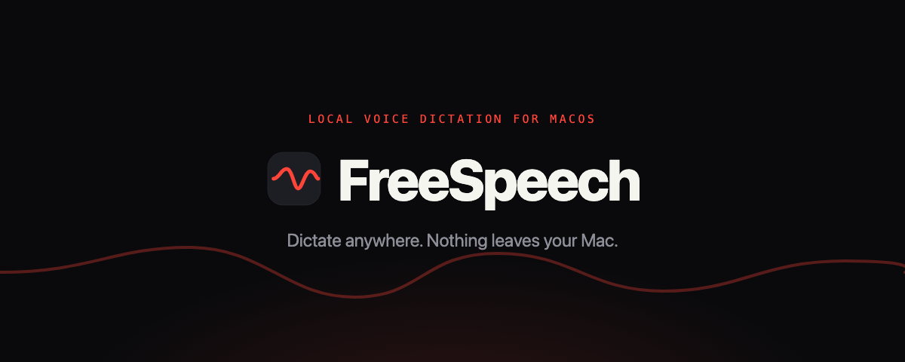

<div align="center">

<picture>
  <source media="(prefers-color-scheme: dark)" srcset=".github/assets/banner-dark.png">
  <source media="(prefers-color-scheme: light)" srcset=".github/assets/banner-light.png">
  
</picture>

<br><br>


**Hold a key, speak, and your words appear wherever the cursor is — transcribed entirely on your Mac.**

</div>

---

FreeKit is a menu-bar dictation app built on a local Whisper model. No cloud, no account, no
telemetry — the only time it touches the network is to download its model once. It's a native Swift
app that stays out of your way: hold **Right Option**, talk, release.

## Features

- **Talk anywhere** — hold your hotkey in any app (Notes, a browser, Slack, your terminal) and the text lands at the cursor.
- **Nothing leaves your Mac** — Whisper runs on-device with Metal acceleration; fully offline after setup.
- **Continue, don't repeat** — reads the field first and picks up where you left off instead of duplicating what you already typed.
- **Catch both sides of a call** — a separate hotkey transcribes system audio, the other person on a Zoom or Meet call.
- **Cleans up as you go** — deterministic tidy-up by default; optional on-device grammar, structure, and tone rewrites.
- **Learns your words** — watches how you edit inserted text and quietly fixes recurring mis-hears.
- **Single-line HUD** — an unobtrusive floating waveform that never steals focus from what you're typing into.

## Requirements

- **Apple Silicon** Mac (M1 or newer)
- **macOS 26** or newer

## Download & install

Grab the [latest release](https://github.com/cifyr/FreeSpeech/releases/latest):

- **[FreeSpeech.zip](https://github.com/cifyr/FreeSpeech/releases/latest/download/FreeSpeech.zip)** — 510 MB, model included, works offline immediately.
- **[FreeSpeech-lite.zip](https://github.com/cifyr/FreeSpeech/releases/latest/download/FreeSpeech-lite.zip)** — 4 MB; downloads the model once on first launch.

Then (see **[INSTALL.md](INSTALL.md)** for detail):

1. Unzip the file.
2. **Right-click** `install.command` → **Open** (approve the one-time unidentified-developer prompt).
3. Grant **Microphone** and **Accessibility** when the setup guide asks.
4. Hold **Right Option** and talk.

The app isn't notarized, so the right-click-Open step is required (a plain double-click is blocked by Gatekeeper). Everything runs on-device.

## Build from source

Requires Xcode command-line tools and `cmake` (`brew install cmake`).

```bash
git clone <this-repo> FreeSpeech && cd FreeSpeech
./build.sh                 # vendors whisper.cpp, runs tests, builds dist/FreeKit.app, fetches the model
open dist/FreeKit.app      # grant Microphone + Accessibility on first run
```

To produce a shareable package:

```bash
./package.sh --app-only    # ~4 MB zip; the app downloads its model on first launch
./package.sh               # ~510 MB zip; bundles the model for offline install
```

## Model

Benchmarked on Apple Silicon (see [`bench/RESULTS.md`](bench/RESULTS.md)). The default,
**`large-v3-turbo-q5_0`**, won the matrix — best accuracy while staying fast:

| Model | Accuracy | Speed | Size |
|---|---|---|---|
| **Turbo (compact)** — default | best | fast | 561 MB |
| Large Turbo | high | fast | 1.6 GB |
| Base | good | fastest | 145 MB |
| Tiny | rough | fastest | 74 MB |

Switch models anytime in **Settings**. Each is described by accuracy and speed, not filename.

## How it's built

Native Swift. `FreeSpeechCore` holds the pure, unit-tested logic (state machine, transcript
cleanup, edit-learning, model catalog); the `FreeSpeech` app target wires it to AppKit, CoreAudio,
ScreenCaptureKit, and a vendored [whisper.cpp](https://github.com/ggml-org/whisper.cpp). On-device
rewrites use Apple's FoundationModels.

---

<div align="center">
<sub>Runs entirely on your Mac · Apple Silicon, macOS 26+</sub>
</div>
